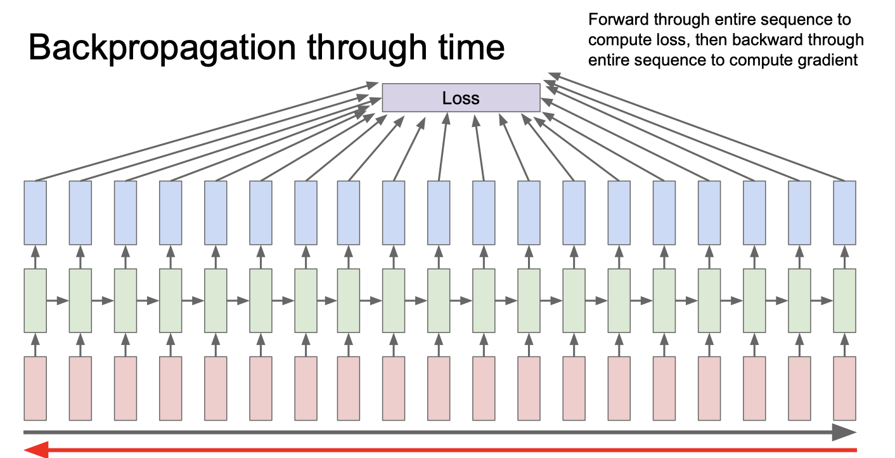

# 10강

# 목차

## Lastime
- Batch normalization 기법이 있으면 GoogLenet의 auxiliary classifier를 사용하지 않아도 됨
- 보통 CNN 에서 파라미터값이 0이면 이상한 현상일 수 있지만 Resnet에서 파라미터값이0 이면 residual identity block 으로 취급 가능함
- resnet의 skip connection은 gradient를 위한 일종의 고속도로 역할을 함

  
## Recurrent Neural Network (RNN)
일반적인 NN 아키텍쳐는 아래 그림과 같음

하지만 rnn은 여러개의 입력과 여러개의 출력을 가질 수 있는 아키텍쳐임

### Example problems of RNN
* one to many: Image Captioning
* many to one: Sentiment Classification
* many to many: Machine Translation ex) seq of words -> seq of words, Video classification on fram level

### Recurrence formula
출력값을 가지려면 ${h_t}$를 입력으로하는 FC-layer 를 추가해야함.

**매 스텝마다 같은 함수와 같은 set의 파라미터가 사용됨.**

네트워크 출력과 입력에 비선형성을 추가해주기 위해 **${tanh}$** activation function 을 사용함

### Computational Graph

대부분의 경우 ${h_0}$ 를 0으로 초기화 시킴

### Truncated Backpropagation through time
- 과거의 데이터를 영원히 앞으로 가져다가 쓰기 때문에 마르코프 연쇄법칙을 따르지 않음

아래 그림과 같이 매우 긴 sqeuence 가 입력으로 주어졌을때 gradient값을 구하기 힘들 수 있음 

이런 문제를 해결하려 truncated backpropagtion 기법을 사용해 sub gradient를 구해 총 gradient에 근사시킴.

gradient step 을 current batch 만큼 진행함.

### Vanilla RNN Gradient Flow

layer가 깊어지면 깊어질수록 ${W_{hh}}$가 같기때문에 **Exploding gradient** 와 **Vanishing gradient** 문제가 발생함

## Long Short Term Memory (LSTM)
RNN에서 발생하는 vanishing 과 exploding gradient 문제점을 해결하기위해 디자인 된 모델

###  gates
* input gate: Wheter to write to cell
* forget gate: Wheter to erase cell
* gate gate: How much write to cell
* output gate: How much to reveal cell