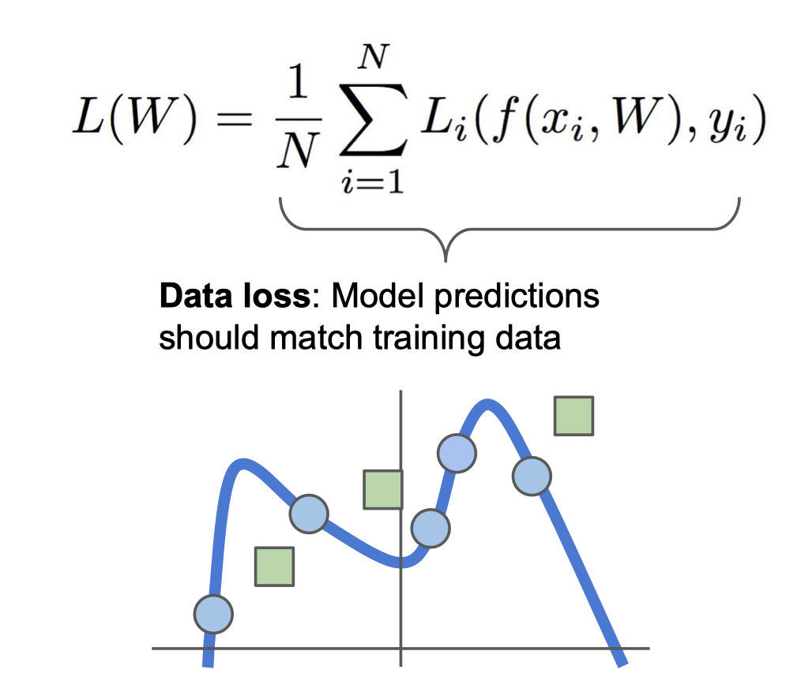

# 3강

# 목차

## Loss functions
학습의 잘못된 정도를 수치화 하는 것

학습데이터와 레이블 데이터 ${(xi,yi)}_i^N$ 가 있을 때 총 loss 값
$$
L = \frac{1}{N}\sum_i{L_i(f(x,W),y_i)}
$$

### Multiclass SVM loss
- 정답 레이블 스코어와 차이를 전부 구해서 더함
- 특정 레이블의 스코어가 조금 변한다 해도 서로간의 margin은 그대로 유지됨으로 Loss는 변하지 않음
- loss의 최대값은 ${\inf}$ 최소값은 $0$임
- loss 값을 sum 대신에 mean 값을 써도 단순히 rescaling 하는 것이기 때문에 큰 영향이 없음
- L을 0으로 만드는 가중치(W) 값은 유일하지 않음

$$
L = \sum_i{max(0, s_j - s_{y^i} + 1)}

$$

### Softmax Classifier
각 스코어는 합이 1인 확률 값임

$$
L = -logP(Y = y_i | X = x_i)
$$

$$
P(Y = y_i | X = x_i) = \frac{e^{sk}}{\sum{e^{sj}}}
$$

## Regularization Loss

### 정규화의 두가지 역할
- 모델이 덜 복잡해지도록 함
- 모델에 soft penalty를 추가함
- 어떤 문제에서 복잡하다는 것을 어떻게 정의할지는 반드시 고민해야함

### 일반적으로 쓰이는 기법
- L1
- L2
- Elastic net(L1 + L2)
- Dropout
- Max norm regularization
- Batch normalization, stocastic depth

아래 수식과 같이 Data loss 만 사용하게 되면 Train set에 fit한 학습을 진행함

Train 데이터에서 한번도 보지 못한 Test 데이터가 들어올 시 그래프는 아래와 같음

이러한 Overfitting 문제를 해결하기위해 Regularization 로스를 사용함

## Optimizations
- 가장 좋은 가중치 값을 찾아가는 것