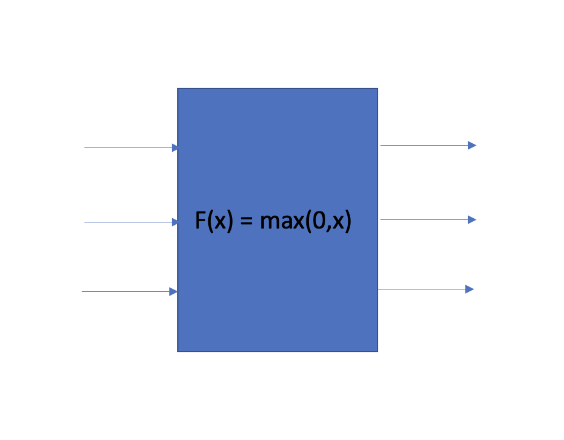

# Questions 4
Q1. 다음 그래프에서 f(x,y,z) 함수를 정의하고 연쇄법칙을 활용해 dx dy dz를 구하시오.

Q2. 그래프의 끝에서 부터 gradient 값을 구 할 때 local gradient 와 ? gradient 값을 구해 현재 노드에서의 gradient 값을 구할 수 있다 ? 에 들어갈 용어를 적으시오.

Q3-1. add gate, max gate, mul gate 의 역할을 설명하시오.

Q3-2. 해당 역할이 어떻게 수행 될 수 있는지 수식을 활용해 설명하시오.

 

Q4. 아래와 같이 여러 노드로부터 gradient 값이 전파 될 경우 upstream 값은 어떻게 정의해야 하는지 설명하시오.

Q5. 아래 그림과 같이 input vector 가 3개 output vector가 3개인 operation이 있을 때 정의되는 jacobian matrix는 어떤 특징을 지니는지 설명하시오.

