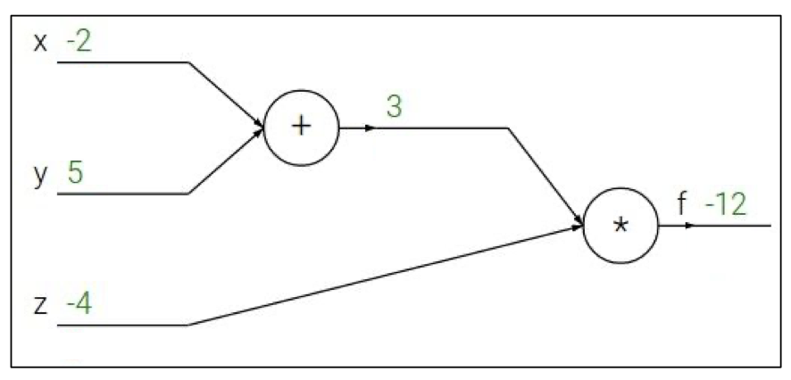

# 4강

# 목차

## Backpropagation
cost function 의 값이 최소가 되도록하는 W 와 b를 찾을 수 있도록하는 알고리즘

### 예시 1

$$
q = x+y,\frac{\partial q}{\partial x} = 1,\frac{\partial q}{\partial y} = 1
$$

$$
f = qz,\frac{\partial f}{\partial q} = z,\frac{\partial f}{\partial z} = q
$$

$$
\frac{\partial f}{\partial x} = ?, \frac{\partial f}{\partial y} = ?, \frac{\partial f}{\partial z} = ?
$$

### 풀이 1

### Gradient flow

## Paterns in backword flow

* Add gate(Gradient distributor)
* Max gate(Gradient router)
* Mul gate(Gradient switcher)

## Vectorized Operations
연산에 필요한 모든 행렬은 자코비안 행렬로 표현가능

아래와 같은 그림에서 연산은 각 요소마다 영향을 끼치기 때문에 자코비안행렬은 대각행렬임
$$ $$

## Vectorized Example

